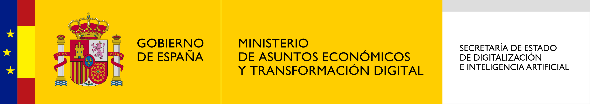

# Introducción

El **Desafío Energía HidroPredictiva** se sitúa en un contexto global donde las renovables y la eficiencia energética son prioridades estratégicas. Con el propósito de maximizar la participación de las energías renovables en el mix energético de España, este desafío, impulsado por el *Programa Nacional de Algoritmos Verdes (PNAV)** de la Administración Pública y desarrollado junto a *Iberdrola*, se enfoca en la predicción precisa de la capacidad de caudales hidráulicos, un factor crítico para optimizar la gestión de los recursos hidroeléctricos y asegurar la estabilidad del sistema eléctrico.

En España, la energía hidroeléctrica es una de las principales fuentes de energía renovable, aprovechando su vasta red de embalses. La operación óptima de estos sistemas depende en gran medida de la capacidad para    prever las condiciones meteorológicas y las variaciones en el flujo de agua. 

Aquí es donde la inteligencia artificial y los modelos predictivos, en línea con los objetivos del Programa Nacional de Algoritmos Verdes, juegan un papel crucial, contribuyendo a anticipar la capacidad de generación y ajustarla a las necesidades energéticas del país en el nuevo paradigma energético basado en una penetración masiva de renovables.

El PNAV reconoce el potencial de la inteligencia artificial y las tecnologías de análisis de datos para mejorar la gestión medioambiental y la eficiencia en el uso de recursos, lo que es esencial en el contexto de este desafío. No obstante, también se subraya la importancia de equilibrar estas herramientas con un enfoque en la sostenibilidad y la reducción del impacto ambiental de los propios algoritmos.

**El Programa Nacional de Algoritmos Verdes (PNAV) es la medida 20 de la Estrategia Nacional de Inteligencia Artificial (ENIA en adelante), situada en Eje Estratégico 4 "Integrar la inteligencia artificial en las cadenas de valor para transformar el tejido económico" y alineada con el Desafío Social 2 de la misma estrategia "Favorecer a la transición ecológica y la reducción de la huella de carbono". EL PNAV está dirigido desde la Subdirección General de Inteligencia Artificial y Tecnologías Habilitadoras Digitales de la Secretaría de Estado de Digitalización e Inteligencia Artificial.*

# Descripción del reto


El objetivo de este desafío es desarrollar uno o más algoritmos que predigan los caudales medios diarios en cinco puntos de la cuenca del Duero en pronósticos a 24 y a 48 horas. La predicción podrá usar mediciones anteriores de caudales al igual que pronósticos de precipitación y otros factores meteorológicos que influyen en el caudal y por tanto serán nuestras variables de interés final. 

Este desafío no solo busca mejorar la predicción del caudal, sino también incorporar prácticas sostenibles en el desarrollo y la implementación de los modelos predictivos. Para ello, se requiere que los participantes utilicen la herramientas que midan en consumo eléctrico de los modelos que entrenen y usen para predecir. En la sección de evaluación podréis leer sobre la librería CodeCarbon, con la que mediréis el consumo de vuestros modelos. 

Para desarrollar los modelos, proveeremos mediciones del caudal en 10 puntos de la cuenca del Duero y un subconjunto de la base de datos de forecasts del modelo meteorológico Global Forecasting System (GFS) a 48 horas. Las variables del GFS ofrecen información detallada sobre las condiciones atmosféricas y del suelo necesarias para la predicción precisa del caudal. Los forecasts del GFS cubren generosamente el área de la península ibérica y comprenden observaciones entre el 01/04/2021 y el 31/03/2024. Las mediciones del caudal comprenden 5 emplazamientos para los cuales se debe medir el caudal y 5 aforos, que se pueden usar como variables predictivas. Contamos con mediciones del caudal para el periodo 01/01/2021 al 31/03/2024.


Los participantes deben desarrollar un modelo predictivo que utilice los datos proporcionados para predecir el **caudal entrante medio a 48 horas en los 5 emplazamientos de la cuenca del Duero.** El modelo debe tener en cuenta tanto los datos históricos de caudal como los datos de aforos previos, que se pueden usar como variables predictoras para mejorar la precisión de las estimaciones.


El mapa muestra los emplazamientos para los cuales predeciremos el caudal con círculos de color rojo y los aforos que usaremos para afinar las predicciones con círculos de color verde. La magnitud del radio de los círculos es proporcional a la media del caudal en cada emplazamiento o aforo entre las fechas que contamos con datos del GFS y  el rectángulo negro delimita las coordenadas de latitud y longitud para las cuales tenemos predicciones del GFS.


**Emplazamientos Involucrados donde hay que predecir el caudal diario (color rojo)**

**Aforos que se pueden utilizar como valor entrante en la predicción de caudal (color verde):**

**Proceso de Medición:**

-----------

Las mediciones de caudal se realizan diariamente en los emplazamientos y aforos, proporcionando datos en m3/s que reflejan el flujo de agua en cada punto. Estos datos son críticos para la predicción de la capacidad de generación hidroeléctrica. Los puntos de medición son monitoreados utilizando sistemas automáticos que registran el caudal en tiempo real, lo que permite ajustar de manera precisa la producción de energía.


Además, los participantes deben considerar lo siguiente:

- **Plataforma de evaluación:** Se evaluará y desarrollará el reto en la plataforma de Kaggle en [https://www.kaggle.com/c/pnav-prediccion-de-caudales](https://www.kaggle.com/c/pnav-prediccion-de-caudales).

- **Datos de Entrada:** Utilizar los datos de caudal medido en m³/s de los 10 puntos de medición de días anteriores para cada emplazamiento. 


- **Características del Modelo:** Desarrollar y probar diferentes técnicas de modelado, que pueden incluir métodos estadísticos, machine learning, o una combinación de ambos, para determinar cuál proporciona las predicciones más precisas.


- **Evaluación del Modelo**: Evaluar el desempeño del modelo utilizando el error absoluto medio (MAE).


- **Presentación de Resultados:** Entregar una documentación completa que explique el enfoque metodológico, los modelos probados, la validación de los resultados y las conclusiones alcanzadas. 

CodeCarbon


----------------------

Los participantes deberán utilizar la librería open-source codecarbon, para medir el consumo eléctrico del desarrollo de su solución. Es requisito que los participantes midan el consumo del **último notebook del que entreguen predicciones**. 

Para esto, los participantes deberán incluir en la primera celda el siguiente código para empezar el proceso de medición:

```
!pip install codecarbon
from codecarbon import EmissionsTracker
tracker = EmissionsTracker()
tracker.start()
```
y, en la última celda del notebook de desarrollo se deberá finalizar el proceso de medición con:

```
tracker.stop()
```

Este proceso creará un archivo llamado emissions.csv, el cual los participantes deben descargar y guardar para el evento presencial. En el [notebook de demonstración](https://www.kaggle.com/code/algoritmosverdespnav/notebook-demo-hidropredictiva), se puede ver un ejemplo de cómo ejecutar la medición del consumo.

Podéis ver más información de CodeCarbon en su [página web](https://codecarbon.io/).


# Evaluación

Las propuestas se evaluarán en base a los siguientes dos conjuntos de criterios:

###**1. Aspectos Cuantitativos que suponen un 60% del peso final:**

- **Poder Predictivo (100%):** Desempeño del modelo según la métrica **MAE**.

Esta métrica se define como:

$$\text{MAE} = \frac{1}{5} \sum_{j=1}^{5} \left( \frac{1}{2} \sum_{k=1}^{2} \left( \frac{1}{n_{jk}} \sum_{i=1}^{n_{jk}} | y_{ijk} - \hat{y}_{ijk} | \right) \right)$$

Ya que el desafío consta en predecir un vector por emplazamiento, calcularemos el MAE pesando cada serie por igual.

#### Descripción de variables

- \( y_{ijk} \): El valor **real** para la observación \(i\)- del emplazamiento\(j\)- y para el valor futuro \(k\)  (de 24 o 48 horas).
- \( \hat{y}_{ijk} \): El valor **predicho** para la observación \(i\)- del emplazamiento\(j\)- y para el forecast \(k\)  (de 24 o 48 horas).
- \( n_{jk} \): Número de observaciones del emplazamiento \(j\)- para el forecast \(k\).
- \( j \): Índice del emplazamiento (1 a 5).
- \( k \): Índice del periodo del forecast (1 para 24 y 2 para 48 horas).
- \( i \): Índice para las observaciones de cada emplazamiento y cada forecast.

En la sección de datos explicaremos más sobre el set de testing.

###**2. Aspectos Cualitativos que suponen un 40% del peso final:** 
*(A evaluar en la Fase II de la competición, el 14 de octubre)*

- **Claridad y Calidad de la Presentación (30%)** 

- **Implementación Técnica (70%):** Revisión de la calidad técnica de la implementación del modelo. *(El consumo energético será calculado mediante la herramienta Code Carbon, que se encargará de medir y reportar las emisiones de carbono generadas durante el proceso de entrenamiento y ejecución de los modelos predictivos)*

    - **Técnicas de Eficiencia (50%):**  Revisión de las técnicas que se han utilizado para eficientar el consumo.
      - Selección de modelos de bajo consumo.
      - Procesamiento y selección de variables para la predicción.
      - Técnicas de testing y validación que contemplen el consumo.
      - Desarrollo de código (eficiente)


   - **Técnicas de predicción (20%)**
      - Selección de modelos
      - Procesamiento y selección de variables
      - Técnicas de testing y validación
      - Explicabilidad y Transparencia


---


## Archivo de entrega de solución

Por cada una de las 26 fechas expuestas en la tabla de la sección de [data](https://www.kaggle.com/competitions/pnav-prediccion-caudal/data), los participantes deben predecir el caudal para cada uno de los 5 emplazamientos en forma de pronósticos a 24 horas y a 48 horas. El archivo debe contener un header y tener el siguiente formato:


    time_name,  caudal_m3/s
    2023-09-05_Emplazamiento 0,0
    2023-09-06_Emplazamiento 0,0
    2023-11-03_Emplazamiento 0,0
    2023-11-04_Emplazamiento 0,0
    2023-12-03_Emplazamiento 0,0
    ..., ....
    2024-04-01_Emplazamiento 4,0
    2024-04-20_Emplazamiento 4,0
    2024-04-21_Emplazamiento 4,0
    2024-06-09_Emplazamiento 4,0
    2024-06-10_Emplazamiento 4,0


En el [notebook de demonstración](https://www.kaggle.com/code/algoritmosverdespnav/notebook-demo-hidropredictiva), se puede ver un ejemplo de cómo hacer el submission. 

**Para la puntuación cuantitativa final los participantes deben escoger hasta 5 submissions.**


# Cronograma

### **1. Parte Cuantitativa (Modelos Predictivos)**
**Fecha límite:** Desde el 20 de septiembre hasta las 12:00 horas del 10 de octubre de 2024.
Los equipos deberán enviar sus modelos predictivos al repositorio designado para su evaluación.


### 2. Parte Cualitativa
**Fecha límite:** Desde el 20 de septiembre hasta el 14 de octubre de 2024 (evento presencial).

Durante el desarrollo de los modelos los participantes deben realizar:
- Medición del Consumo Energético durante el entrenamiento e inferencia de los modelos, usando la herramienta Code Carbon.
- Los datos de consumo energético se revisarán como parte de la presentación final.


### 3. Evento Presencial
**Fecha:** 14 de octubre de 2024, de 9:30 a 17:30 horas en Madrid.

Los equipos tendrán un espacio reservado durante la mañana para preparar una exposición de sus soluciones junto con un mentor asignado.
Durante la tarde se reservará un espacio temporal para la exposición, donde presentarán sus soluciones ante el jurado y serán evaluados en los aspectos cualitativos de su modelo.

**Formato de Presentación:**
- 5 minutos de exposición + 5 minutos de preguntas del jurado.
- Máximo 5 diapositivas en formato PPT, letra Arial 11.

**Jurado**
 - Luis Prieto Godino (Sistemas de predicción @ Iberdrola)
 - Luis Malumbres Martínez (Innovación @ Iberdrola)
 - Elena Gonzalez-Blanco (Head of AI for EMEA Digital Natives @ Microsoft)
 - Fernando Suarez (Presidente @ Consejo General de Ingeniería Informática de España)


 ### Esta es una competición de código. Los participantes deberán entregar la última versión de su notebook. 


Todos los submissions se deben hacer a través de Notebooks.  Se deben cumplir las siguientes condiciones para que el botón "Submit" esté activo después de un commit:

- CPU Notebook <= 9 horas de tiempo de ejecución
- GPU Notebook <= 9 horas de tiempo de ejecución


Se concede el acceso a internet.


Está permitido utilizar datos externos mientras estos sean públicos y gratis (excepto por otros modelos de pronóstico meteorológicos), incluyendo modelos pre-entrenados.


El archivo de submission se debe llamar submission.csv. 


En el notebook final se valorará:

- la eficiencia (e.g. vectorización, etc.).

- la claridad y la legibilidad del código (e.g. estilo, comentarios, docstrings, PEP-8, etc.). 


# Premios

Los premios incluirán tanto reconocimientos reputacionales como oportunidades de formación, becas y la posibilidad de colaborar en futuros proyectos con las entidades organizadoras y colaboradoras, entre las cuales se incluyen:
•	Visita a uno de los centros/instalaciones de Iberdrola.
•	Acceso al programa Microsoft for Startups Founders Hub y coaching durante un periodo máximo de 6 meses. Este programa incluye el uso de los modelos de inteligencia artificial más avanzados a través de Azure, como OpenAI GPT-4, y la posibilidad de conseguir hasta $150.000 en créditos de Azure.
•	Programa de Partnership Accenture para Pymes, que ofrece la posibilidad de colaborar estrechamente con empresas, startups y profesionales innovadores que demuestren un alto potencial en el desarrollo de soluciones tecnológicas avanzadas.
•	Acceso a materiales de formación de Microsoft, incluye cursos en línea y recursos educativos que ayudarán a los participantes a adquirir y validar habilidades en tecnologías clave.


# Organizador y colaboradores

Esta competición está organizada por la **SEDIA** y el **Ministerio para la Transformación Digital y de la Función Pública** en colaboración con **Iberdrola.**




Contamos con el apoyo de Iberdrola, Accenture y Microsoft, quienes han aportado datos, premios e instalaciones para hacer posible esta iniciativa. 


# Citación

Algoritmos Verdes PNAV. PNAV: Predicción de caudales. https://kaggle.com/competitions/pnav-prediccion-de-caudales, 2024. Kaggle.
